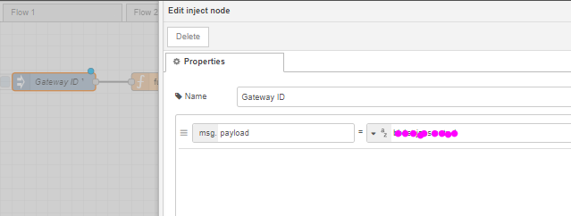
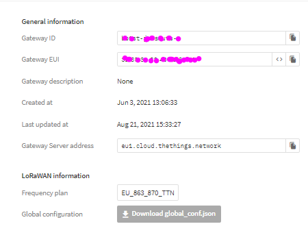

<!-- PROJECT LOGO -->
<br />
<p align="center">
  <a href="https://github.com/JohanScheepers/TTN_Gateway_Notification">
    
  </a>

  <h3 align="center">TTN Gateway Radius and New Node</h3>

  <p align="center">
    Project is aimed to use the TTN API to plot gateways and location of potential new node on map
    <br />
    <a href="https://github.com/JohanScheepers/TTN_Gateway_Notification"><strong>Explore the docs »</strong></a>
    <br />
    <br />
    <a href="https://github.com/JohanScheepers/TTN_Gateway_Notification/blob/main/images/gatewayRadius.gif">View Demo</a>
    •
    <a href="https://github.com/JohanScheepers/TTN_Gateway_Notification/issues">Report Bug</a>
    •
    <a href="https://github.com/JohanScheepers/TTN_Gateway_Notification/issues">Request Feature</a>
  </p>
</p>


<!-- TABLE OF CONTENTS -->
<details open="open">
  <summary><h2 style="display: inline-block">Table of Contents</h2></summary>
  <ol>
    <li>
      <a href="#about-the-project">About The Project</a>
      <ul>
        <li><a href="#built-with">Built With</a></li>
      </ul>
    </li>
    <li>
      <a href="#getting-started">Getting Started</a>
      <ul>
        <li><a href="#prerequisites">Prerequisites</a></li>
        <li><a href="#installation">Installation</a></li>
      </ul>
    </li>
    <li>
	<a href="#usage">Usage</a>
	<ul>
        <li><a href="#gateway-within-radius">Gateway within Radius</a></li>
        <li><a href="#radius-around-gateway">Radius around Gateway</a></li>
        <li><a href="#plot-new-node">Plot New Node</a></li>
	   <li><a href="#airtime-calculator-for-loRaWAN">Airtime calculator for LoRaWAN</a></li>
	   <li><a href="#the-things-network-status-page">The Things Network Status Page</a></li>
        <li><a href="#demo">Demo</a></li>
        <li><a href="#flow">Flow</a></li>
      </ul>
    </li> 
    <li><a href="#roadmap">Roadmap</a></li>
    <li><a href="#license">License</a></li>
    <li><a href="#contact">Contact</a></li>
  </ol>
</details>


<!-- ABOUT THE PROJECT -->
## About The Project

In this project we are going to call on a TTN API. Namely the <a href="https://mapper.packetbroker.net/api/v2/gateways/netID=000013,tenantID=ttn,id=bb1st-jansmuts-1">TTN Gateway API</a> to get gateway specific data. This API will return the status of the gateway, namely if it is online or offline.


### Built With

* []()Node-Red
* []()node-red-contrib-telegrambot
* []()TTN API


<!-- GETTING STARTED -->
## Getting Started

To get a local copy up and running follow these simple steps.

### Prerequisites

* Node-Red
  ```sh
  https://nodered.org/docs/getting-started/
  ```

* node-red-contrib-telegrambot
  ```sh
  https://flows.nodered.org/node/node-red-contrib-telegrambot
  ```
### Installation

1. Install Node-Red following the relevant getting started guide for your operating system form the official website
   ```sh
   https://nodered.org/docs/getting-started/
   ```
2. Install npm  package node-red-dashboard
   ```sh
   npm install node-red-contrib-telegrambot
   ```
4. Install the Node-Red flow
   ```sh
   https://github.com/JohanScheepers/TTN_Gateway_-Notification-/blob/master/flow/TTN_Gateway_Radius.json
   ```

5. There is a inject node at the beginning of the flow “Gateway ID”, copy and paste for each of your gateways.

6. In the string field add your gateway “Gateway ID” 





<!-- USAGE EXAMPLES -->
## Usage

The flow will pole every 6 min the API and if the Gateway is off line, will send a message to telegram notifying you.


<!-- ROADMAP -->
## Roadmap

See the [open issues](https://github.com/JohanScheepers/TTN_Gateway_Notification/issues) for a list of proposed features (and known issues).


<!-- LICENSE -->
## License

Distributed under the MIT License. See `LICENSE` for more information.


<!-- CONTACT -->
## Contact


Project Link: [https://github.com/JohanScheepers/TTN_Gateway_Notification](https://github.com/JohanScheepers/TTN_Gateway_Node)


<!-- MARKDOWN LINKS & IMAGES -->
<!-- https://www.markdownguide.org/basic-syntax/#reference-style-links -->

[forks-shield]: https://img.shields.io/github/forks/JohanScheepers/repo.svg?style=for-the-badge
[forks-url]: https://github.com/JohanScheepers/repo/network/members
[stars-shield]: https://img.shields.io/github/stars/JohanScheepers/repo.svg?style=for-the-badge
[stars-url]:https://github.com/JohanScheepers/TTN_Gateway_Notification/stargazers
[issues-shield]: https://img.shields.io/github/issues/JohanScheepers/repo.svg?style=for-the-badge
[issues-url]: https://github.com/JohanScheepers/repo/issues
[license-shield]: https://img.shields.io/github/license/JohanScheepers/repo.svg?style=for-the-badge
[license-url]: https://github.com/JohanScheepers/repo/blob/master/LICENSE.txt
[linkedin-shield]: https://img.shields.io/badge/-LinkedIn-black.svg?style=for-the-badge&logo=linkedin&colorB=555
[linkedin-url]: https://www.linkedin.com/in/johan-scheepers-6a263514a/
